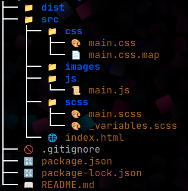

# WoodyLS aka. Enhanced Tree Command 🌳

This was actually just a learning project for me, but I now use the command regularly. It's just my version of the `tree` command with a few less options so far but with icons. Verison: 1.0.0



## Features ✨

**Visuals**
- 🎨 Color-coded output (directories, files, symlinks)
- 🏷️ 50+ file type icons

**Functionality**
- 🔍 Recursive directory listing (`-r` option)
- 👁️ Hidden file visibility (`-a` option)
- 🔗 Symlink detection with target paths

## Installation 📦

### Method: Quick Install (with alias)
```bash
# Clone repository
git clone https://github.com/lukasfischer1998/woodyLS.git ~/.tree-command

# Make executable
chmod +x ~/.tree-command/bin/treeLS.sh

# Add to shell config (choose one):
echo 'alias tree="~/.tree-command/bin/treeLS.sh"' >> ~/.bashrc  # Bash
echo 'alias tree="~/.tree-command/bin/treeLS.sh"' >> ~/.zshrc   # Zsh

# Reload shell
source ~/.bashrc  # or source ~/.zshrc

# Check Install
tree --version
```

## Usage 🛠️

```bash
tree [OPTIONS]
-r, --recursive         Show recursive directory tree
-a, --all               Show hidden files
-d, --dirs-only         Show directories only
-i, --include-ignored   Show normally ignored directories ( node_modules etc.)
-rd, -dr                Show recursive directories only
-ra, -ar                Show recursive with hidden files
-v, --version           Show version information
-h, --help              Show help message
```

## Contributing 🤝

1. Fork the repository
2. Create a feature branch
3. Open a Pull Request

## Built With 🛠️

- **Bash 5.0+**
- **Unicode 13**
- **ANSI Colors**


## License 📜
MIT License - See [License](LICENSE) file